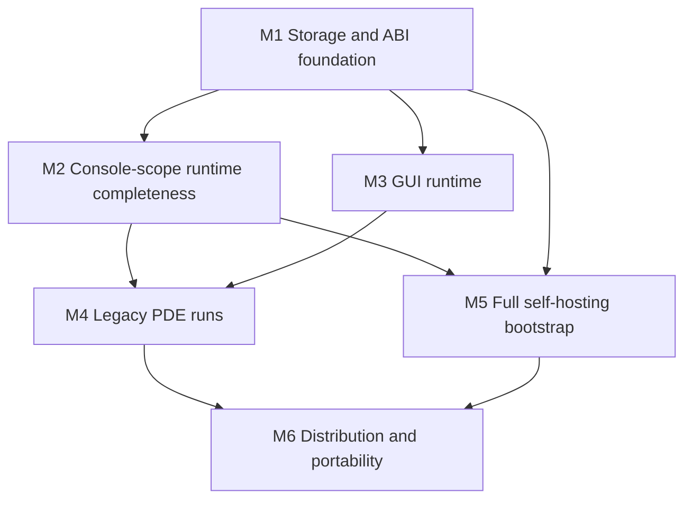

# 20 — Port-completion roadmap: everything legacy, self-bootstrapped

> Status: forward milestone sequence, updated 2026-09-01 after the
> self-hosting-purpose/testability panel. `docs/17-open-work-roadmap.md` is the
> sole open-work and evidence ledger; this document orders its rows toward the
> end state. Historical measurements below are not current-green claims.

## 0. The milestone (end state, concretely)

**"Everything from legacy XBasic codes and its own bootstraps"** means all of:

1. **Every ported legacy source works.** All 151 `.x` files in `xbasic/`
   (15 core libs + 133 demos + 3 helpsrc) compile through the C backend and
   run with behavior matching the interpreter — including GUI demos, not
   just console programs.
2. **The legacy PDE runs.** `xit.x` + `xutpde.x` (the original development
   environment, an XBasic GUI program) launches on the remake's GUI runtime:
   edit, compile, run a program from inside it.
3. **The toolchain bootstraps itself.** The self-hosted compiler
   (`selfhost/compiler.x` + `cgen.x`, written in XBasic) reaches a 3-stage
   byte-identical fixed point **while compiling the full corpus** — not just
   the v0.1 subset — and the natively-built `xb` rebuilds itself.
4. **It ships.** Packaged CLI + runtime + headers + `.dec` surface, license
   obligations resolved (RR-11), at least Linux/macOS; Windows per M6.

Explicit non-goals of the milestone: x87 bit-exact FPU semantics (JIT-X87
stays deferred), 32-bit binary compatibility with `libxb64.a`, and re-porting
the generated `.s` assembly (replaced by the Rust/C backends by design).

## 1. Historical verified baseline (2026-08-31)

| Surface | State |
|---|---|
| Interpreter | 106/106 non-platform demos byte-faithful; 0 genuine failures; GUI demos blocked on runtime |
| C backend (Rust CEmitter) | 15/15 core libs cc-clean; 114/114 demos compile, 112 match (2 real-I/O skips); 175 pure + 165 stateful behavior checks |
| Self-hosted cgen.x | byte-identical to Rust CEmitter on positive corpus (sync 64/64); bootstrap fixed point on v0.1 subset |
| LLVM backend (feature) | 106/106 faithful on interpreter-clean programs; CI job green |
| Corpus | tracked `xbasic/` tree (lib/include/demo/crtl/helpsrc/help/templates); licenses audited (`xbasic/LICENSES.md`) |
| Licensing | remake code MIT; ported tree GPL-2/LGPL-2.1; RR-11 legal residue = 3 no-notice shims |
| IDE | `crates/xb-ide` scaffold only (egui optional deps); legacy PDE not runnable (needs GUI runtime) |

> **Active development notice (2026-09-01):** the latest targeted run passed
> the gtk/helpsrc compile guard but the raw cgen demo compile gate failed for 21
> demos on missing label definitions; the positive-corpus `fileio_test` golden
> also needs resolution. No milestone is closed from the historical table
> alone. Current defects and named exit gates live in docs/17.

## 2. Milestone graph

M2 and M3 are parallel tracks once M1 lands. M5 needs M1 (storage model) and
M2 (real builtins) but not the GUI. M4 is the integration milestone; M6 ships.

## 3. Milestones

### M1 — Semantic storage & ABI convergence (size: XL, the critical path)

Everything hard downstream depends on both C generators consuming the same
frontend facts and implementing the same storage/runtime ABI. M1 is active.
Facet, shared-array, descriptor, and AT-write slices have landed historically,
but the current named gates are not green; completion is based on re-executed
behavior, compile, and bootstrap checks rather than landed code alone.

Work packages (canonical open rows live in docs/17):

1. **Restore contract gates.** Fix cgen label-definition emission, resolve the
   positive-corpus `fileio_test` mismatch, and complete the active SUBADDR
   type-aware lowering without parser special cases.
2. **Finish CGEN-FACET-MANIFEST.** Emit and consume complete scope-qualified
   facts for `strDual`, `allStrArr`, `sharedArrays`, and `xstArrays`; add direct
   nested/shared/composite facet contracts; delete each replaced scanner and
   fallback together.
3. **Close storage and call ABI behavior.** 1-D, 2-D, and hash-prefix
   `#name[]` SHARED heap-globals are locked
   (`cemitter_and_cgen_agree_on_shared_array_cross_function`,
   `cemitter_and_cgen_agree_on_shared_2d_array_cross_function`,
   `cemitter_and_cgen_agree_on_hash_shared_array_cross_function`). Remaining:
   by-ref descriptors including REDIM-through-byref (minimal lock exists),
   composite by-value and return paths, and AT-write byte semantics with
   interpreter/CEmitter/cgen probes. General composite-array by-ref remains
   governed by docs/18.
4. **Resolve remaining memory/runtime contracts.** Decide real `ATTACH`
   aliasing versus the documented bounded copy model, and implement required
   C-library time/file helpers against observable programs rather than stubs.
5. **Run the modularization gate after scanner retirement.** Measure the
   reduced `cgen.x` dependency graph, then choose deterministic fragments,
   native multi-unit support, or a retained single source. If fragments are
   chosen, canonical assembly freshness and isolated module contracts are
   mandatory. No concatenation mechanism is pre-approved.

Exit gate:

- The raw demo, gtk/helpsrc, 15-library, positive-corpus, and
  `cgen_cemitter_sync` gates pass without post-emission repair.
- Direct facet tests cover every retired classifier; no replaced scanner or
  fallback remains.
- Named three-engine behavior probes cover shared arrays, descriptor REDIM,
  composite calls, and AT writes.
- The composite-signature injection filter is removed, and bootstrap
  fixed-point checks remain exact.

Risk control: keep changes contract-sized. A new source-string classifier, a
parser input special case, or a weaker test assertion is not an admissible fix.

### M2 — Console-scope runtime completeness (size: M, parallel after M1)

Make every non-GUI legacy behavior real, not stubbed.

In scope:
- Real `XstStringToNumber`, `XstQuickSort`, `XstCopyArray` (coordinated
  interp + C backend per the byte-faithful lock; golden-safe).
- Float formatting parity: shortest-round-trip decimal (Ryū/Grisu-class) in
  the C runtime so computed-float prints match the interpreter (`geo.x`
  class); mirrored in cgen.x.
- File/time runtime correctness on top of M1's time builtins
  (`XstFileTimeToDateAndTime` fields become real).
- XBSourceLib 13/13 clean (local-only tree; tests keep skip-if-absent).

Exit gate: every non-GUI demo + XBSourceLib program byte-faithful across
interp/C (and LLVM where feature-on); `ary.x` runs correct (perf caveat
documented — its O(n²) is source-side, INTERP-PERF-ARY stays wontfix).

### M3 — GUI runtime (size: XL, parallel with M2)

The single biggest absence. Per docs/12: winit + softbuffer as the
GDI/Xlib shim, no attempt to resurrect 32-bit X11 assembly.

Staged bottom-up, each stage with a runnable probe:
1. **Window + surface + event pump**: `XgrCreateWindow`, message loop
   delivery into XBasic `FUNCADDR` handlers (the interp already dispatches
   funcaddrs; wire real events). Probe: `agrids`/`xgrids`/`warning` stop
   overflowing and draw grids.
2. **xgr (GraphicsDesigner)**: drawing primitives, fonts, images on the
   softbuffer surface. Probe: `DrawScaled`, `aviewbmp`, `gif`/`gifview`.
3. **kernel32/gdi32/user32 shim semantics**: the no-notice shims are thin
   Win32-call forwarders; implement the called subset as runtime builtins
   (RT-KERNEL32 precedent). License note: implement from observed call
   signatures, not from the shim sources (RR-11).
4. **xui (GuiDesigner)**: widget toolkit on xgr; `XuiGetDefaultMessageFuncArray`
   allocates real byref arrays (needs M1 descriptors). Probe: the 40
   message-loop demos run interactively; `xcol` color lib behavior tests.

Exit gate: all 19 GTK-class + 40 message-loop demos launch, render, and
respond; GUI-lib behavior checks (xui/xgr/xcol) exist in the suite.
Non-goal here: pixel-identical rendering to 2002 X11 — assert structure
(window tree, grid contents, event responses), not raster bytes.

### M4 — Legacy PDE runs (size: L; needs M2 + M3)

The original IDE is just another XBasic GUI program — the milestone's
"real workable IDE" is the legacy one, resurrected.

In scope:
- `xit.x` + `xutpde.x` compile AND run on the GUI runtime (they already
  cc-compile; the runtime paths — editor buffers, `XstLoadStringArray`,
  help browsing via ported `help/` — become real).
- Compile/run integration: the PDE's "Run" invokes the remake toolchain
  (`xb --run` / `--compile`) instead of the legacy in-process compiler hooks.
- `crates/xb-ide` becomes the thin native host: window embedding, file
  dialogs, clipboard — NOT a reimplemented IDE. The egui scaffold stays an
  optional alternative frontend, explicitly secondary to the legacy PDE.

Exit gate (scripted, human-verifiable): launch PDE → open `demo/ahello.x`
→ edit → compile → run → output visible → set/inspect a variable in the
debugger pane. One end-to-end automated smoke (event injection) locked in CI.

### M5 — Full self-hosting bootstrap (size: XL; needs M1, M2)

Grow the bootstrap from the v0.1 subset to the full language.

In scope:
- **Language coverage ratchet**: extend `selfhost/compiler.x` (parser/
  semantics in XBasic) + `cgen.x` until they accept the full corpus. Ratchet
  test: a corpus-coverage floor that only goes up (mirroring MIG-CORPUS-GATE)
  compiled BY the selfhost toolchain, not just the Rust one.
- **3-stage fixed point at full scope**: stage1 (Rust xb) builds selfhost →
  stage2 (native selfhost) builds selfhost → stage3 byte-identical to
  stage2, while compiling all 15 libs + demos, not only the v0.1 goldens
  (`checks/verify-bootstrap.sh` grows floors).
- **Self-rebuild**: the natively-built `xb` compiles `xbasic/lib/*.x` into
  the same objects the Rust-built one produces (byte-compare gate).

Exit gate: `verify-bootstrap.sh` proves stage2==stage3 over the full corpus;
CI runs it; docs/14 flips to "self-hosting: full".

Risk: every cgen.x change is double-implemented (Rust CEmitter mirror rule).
Mitigation: land M1's facet manifest first so both generators derive
storage decisions from shared computed facts instead of parallel logic.

### M6 — Distribution & portability (size: M/L; needs M4, M5)

- **PACKAGING**: `xb` CLI + runtime lib + headers + `.dec` surface as an
  installable artifact (the first external consumer unblocks the design).
- **C-BACKEND-PORTABILITY**: MSVC-compatible emitted C (no `__attribute__`
  reliance without fallbacks, `weak` alternatives) → Windows CI leg.
- **RR-11 closure**: resolve the 3 no-notice shims (upstream contact or
  clean-room replacement per M3 stage 3 — the shim *sources* may become
  unnecessary once their called subset is native builtins, which retires
  the redistribution question for binaries).
- **RR-12 reassessment**: keep/expand LLVM backend by demonstrated need.
- Release: tag 6.5.0, changelog, `xbasic/` tree + MIT toolchain.

Exit gate: a downloadable release a third party can install and use to run
the PDE and compile the demos on Linux/macOS (+ Windows if MSVC leg green).

## 4. Verification contract matrix

The project keeps extensive tests because it must preserve legacy behavior and
support modern execution. Coverage is organized by owned contract, not by a
target test count:

| Layer | Owned contract | Evidence shape |
|---|---|---|
| 1. Frontend and typed IR | syntax, diagnostics, lowering, scope-qualified facets, Text IR round-trip | fast unit/contract fixtures |
| 2. Generator-local logic | expression/statement/storage decisions within Rust modules and, after stable seams exist, isolated cgen units | focused unit or tiny harness tests |
| 3. Generated C and ABI | warning-clean compilation, helper signatures, symbols, layouts, cross-object calls | C compile/link probes |
| 4. Three-engine behavior | interpreter, Rust `CEmitter`, and native `cgen.x` agree on stdout/stderr, exit status, state, and permitted effects | deterministic differential fixtures |
| 5. Original compatibility | ported source parses/lowers and named original programs/libraries retain observable behavior | legacy corpus and library behavior suites |
| 6. Bootstrap closure | native compiler/cgen stages converge without generational drift | exact IR/C/binary fixed-point checks |
| 7. Platform and safety | GUI/event integration, filesystem/network/shell gates, bounds/OOM behavior, supported OS/toolchains | platform and adversarial integration gates |

Emitted-C byte identity is required only for the positive diagnostic corpus.
Exact stage identity remains required for bootstrap fixed points. Demo/library
C formatting identity is not a correctness contract. Existing pairwise suites
are not deleted merely to create a unified harness; consolidation must preserve
or improve diagnostic locality, runtime, and every observable assertion.

## 5. Cross-cutting invariants (hold at every step)

1. **Two-generator contract and differential lock:** every lowering or ABI
   change updates the shared typed-IR/runtime-ABI contract, both generators
   unless explicitly backend-only, and the smallest affected differential
   gate (docs/16).
2. **Observable-behavior lock:** interpreter/backend changes land coordinated;
   formatting or internal structure never substitutes for behavior.
3. **Compatibility/safety conflicts are explicit:** a modern guard that changes
   legacy behavior needs a named compatibility decision and regression probe;
   neither side silently wins.
4. **License boundary:** original code and clean-room remake code remain under
   their documented provenance rules; unresolved shim distribution stays
   blocked (RR-11).
5. **Tracked corpus authority:** required gates target the repository corpus;
   local-only material remains supplemental and skip-if-absent.
6. **Runnable, truthful gates:** no time estimates or raw test-count goals;
   historical green snapshots and current active regressions are labeled
   separately.

## 6. Immediate next actions

1. Restore the raw cgen demo and positive-corpus gates: emit referenced
   `xb_label_*` definitions, resolve `fileio_test`, and finish type-aware
   SUBADDR lowering.
2. Complete remaining facet facts and direct facet tests; delete corresponding
   cgen scanners/fallbacks one classifier at a time.
3. Re-run and record the M1 shared-array, descriptor-REDIM, composite-call, and
   AT-write behavior probes across the applicable engines.
4. Only after scanner retirement, execute the cgen modularization decision gate
   and record its chosen mechanism and falsifiable acceptance checks in docs/17.
5. Start M2 console-runtime and M3 GUI work from the re-verified M1 exit, not
   from the historical baseline.
