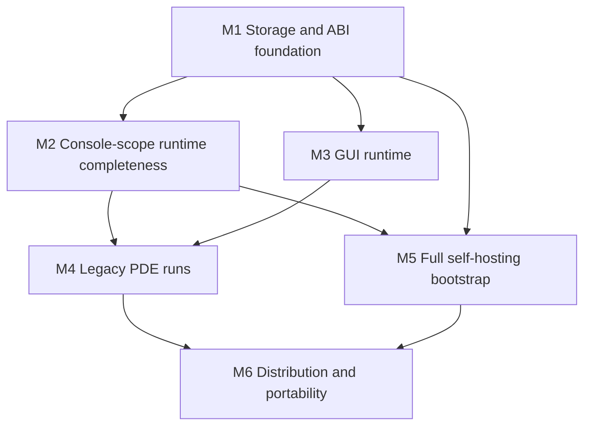

# 20 — Port-completion roadmap: everything legacy, self-bootstrapped

> Status: forward milestone plan. `docs/17-open-work-roadmap.md` remains the
> sole open-work ledger; this document sequences its open items toward one
> end state. Item IDs below refer to docs/17 rows. Created 2026-08-31 at
> `62c617b` (MIT relicense; tracked `xbasic/` corpus).

## 0. The milestone (end state, concretely)

**"Everything from legacy XBasic codes and its own bootstraps"** means all of:

1. **Every ported legacy source works.** All 151 `.x` files in `xbasic/`
   (15 core libs + 133 demos + 3 helpsrc) compile through the C backend and
   run with behavior matching the interpreter — including GUI demos, not
   just console programs.
2. **The legacy PDE runs.** `xit.x` + `xutpde.x` (the original development
   environment, an XBasic GUI program) launches on the remake's GUI runtime:
   edit, compile, run a program from inside it.
3. **The toolchain bootstraps itself.** The self-hosted compiler
   (`selfhost/compiler.x` + `cgen.x`, written in XBasic) reaches a 3-stage
   byte-identical fixed point **while compiling the full corpus** — not just
   the v0.1 subset — and the natively-built `xb` rebuilds itself.
4. **It ships.** Packaged CLI + runtime + headers + `.dec` surface, license
   obligations resolved (RR-11), at least Linux/macOS; Windows per M6.

Explicit non-goals of the milestone: x87 bit-exact FPU semantics (JIT-X87
stays deferred), 32-bit binary compatibility with `libxb64.a`, and re-porting
the generated `.s` assembly (replaced by the Rust/C backends by design).

## 1. Verified baseline (2026-08-31)

| Surface | State |
|---|---|
| Interpreter | 106/106 non-platform demos byte-faithful; 0 genuine failures; GUI demos blocked on runtime |
| C backend (Rust CEmitter) | 15/15 core libs cc-clean; 114/114 demos compile, 112 match (2 real-I/O skips); 303 pure + 128 stateful behavior checks |
| Self-hosted cgen.x | byte-identical to Rust CEmitter on positive corpus (sync 63/63); bootstrap fixed point on v0.1 subset |
| LLVM backend (feature) | 106/106 faithful on interpreter-clean programs; CI job green |
| Corpus | tracked `xbasic/` tree (lib/include/demo/crtl/helpsrc/help/templates); licenses audited (`xbasic/LICENSES.md`) |
| Licensing | remake code MIT; ported tree GPL-2/LGPL-2.1; RR-11 legal residue = 3 no-notice shims |
| IDE | `crates/xb-ide` scaffold only (egui optional deps); legacy PDE not runnable (needs GUI runtime) |

## 2. Milestone graph

M2 and M3 are parallel tracks once M1 lands. M5 needs M1 (storage model) and
M2 (real builtins) but not the GUI. M4 is the integration milestone; M6 ships.

## 3. Milestones

### M1 — Storage & ABI foundation (size: XL, the critical path)

Everything hard downstream (GUI libs, PDE, full bootstrap) is blocked on how
arrays, composites, and shared storage lower to C. Do this first, once,
instead of per-feature workarounds.

In scope (docs/17 IDs):
- **CGEN-FACET-MANIFEST** (docs/19): per-variable storage-facet manifest so
  the two C generators agree on scalar/array/string/composite storage from
  one computed source of truth. Prerequisite for everything below.
- **CGEN-SHARED-ARR / SHARED-array end-to-end**: `SHARED a[]` and `#name[]`
  as correctly-typed module globals (parser SharedName arrays → semantics
  shared-array tracking → IR node → CEmitter + cgen.x mirror). Unblocks
  xui/xgr/xcol behavior tests and the blocked xst functions
  (`XstErrorNameToNumber`, `XstGetEnvironmentVariable`, …).
- **Byref array descriptor ABI** (docs/18): `{data, dims}` descriptors for
  `@array[]` params with REDIM-through-byref, shared across interp/C/LLVM.
- **Composite call ABI completion**: composite byval args, composite returns
  for import-only functions (re-enable the `resolve_import_decls` composite
  filter dropped 2026-08-31 — search `c_emit`/cli for the RR-08 comment),
  `TokenMatch`/`ReplaceArray`/`FindArray` xit tests as the acceptance probes.
- **ATTACH real aliasing**: today interp has copy-semantics cases 1–5 and
  text IR drops ATTACH as Nop. Decide and implement the real model (view
  binding), or formally spec copy-semantics as the remake's documented
  behavior; either way cgen.x must stop parser-discarding it in
  xcol/xst/xgr/xui/xit.
- **UBYTEAT/UWORDAT write support** (unblocks `XstGetEndian`).
- **C-library builtins**: `gmtime`/`localtime`/`mktime`/`gettimeofday` in
  the builtin table + runtime helpers (time functions currently emit 0).

Exit gate:
- Behavior checks grow past 431 with ≥1 SHARED-array-dependent xst function
  and ≥1 composite-byval xit function locked.
- All 15 libs still cc-clean via BOTH generators; sync 63/63 holds;
  bootstrap fixed point unchanged.
- The composite-signature injection filter is removed (decls flow whole).

Risks: this touches the frozen text-IR contract and cgen.x byte-identity —
every step gated on `cgen_cemitter_sync` + bootstrap verify, exactly like
the SEL-CASE-TRUE / facet-1 precedents.

### M2 — Console-scope runtime completeness (size: M, parallel after M1)

Make every non-GUI legacy behavior real, not stubbed.

In scope:
- Real `XstStringToNumber`, `XstQuickSort`, `XstCopyArray` (coordinated
  interp + C backend per the byte-faithful lock; golden-safe).
- Float formatting parity: shortest-round-trip decimal (Ryū/Grisu-class) in
  the C runtime so computed-float prints match the interpreter (`geo.x`
  class); mirrored in cgen.x.
- File/time runtime correctness on top of M1's time builtins
  (`XstFileTimeToDateAndTime` fields become real).
- XBSourceLib 13/13 clean (local-only tree; tests keep skip-if-absent).

Exit gate: every non-GUI demo + XBSourceLib program byte-faithful across
interp/C (and LLVM where feature-on); `ary.x` runs correct (perf caveat
documented — its O(n²) is source-side, INTERP-PERF-ARY stays wontfix).

### M3 — GUI runtime (size: XL, parallel with M2)

The single biggest absence. Per docs/12: winit + softbuffer as the
GDI/Xlib shim, no attempt to resurrect 32-bit X11 assembly.

Staged bottom-up, each stage with a runnable probe:
1. **Window + surface + event pump**: `XgrCreateWindow`, message loop
   delivery into XBasic `FUNCADDR` handlers (the interp already dispatches
   funcaddrs; wire real events). Probe: `agrids`/`xgrids`/`warning` stop
   overflowing and draw grids.
2. **xgr (GraphicsDesigner)**: drawing primitives, fonts, images on the
   softbuffer surface. Probe: `DrawScaled`, `aviewbmp`, `gif`/`gifview`.
3. **kernel32/gdi32/user32 shim semantics**: the no-notice shims are thin
   Win32-call forwarders; implement the called subset as runtime builtins
   (RT-KERNEL32 precedent). License note: implement from observed call
   signatures, not from the shim sources (RR-11).
4. **xui (GuiDesigner)**: widget toolkit on xgr; `XuiGetDefaultMessageFuncArray`
   allocates real byref arrays (needs M1 descriptors). Probe: the 40
   message-loop demos run interactively; `xcol` color lib behavior tests.

Exit gate: all 19 GTK-class + 40 message-loop demos launch, render, and
respond; GUI-lib behavior checks (xui/xgr/xcol) exist in the suite.
Non-goal here: pixel-identical rendering to 2002 X11 — assert structure
(window tree, grid contents, event responses), not raster bytes.

### M4 — Legacy PDE runs (size: L; needs M2 + M3)

The original IDE is just another XBasic GUI program — the milestone's
"real workable IDE" is the legacy one, resurrected.

In scope:
- `xit.x` + `xutpde.x` compile AND run on the GUI runtime (they already
  cc-compile; the runtime paths — editor buffers, `XstLoadStringArray`,
  help browsing via ported `help/` — become real).
- Compile/run integration: the PDE's "Run" invokes the remake toolchain
  (`xb --run` / `--compile`) instead of the legacy in-process compiler hooks.
- `crates/xb-ide` becomes the thin native host: window embedding, file
  dialogs, clipboard — NOT a reimplemented IDE. The egui scaffold stays an
  optional alternative frontend, explicitly secondary to the legacy PDE.

Exit gate (scripted, human-verifiable): launch PDE → open `demo/ahello.x`
→ edit → compile → run → output visible → set/inspect a variable in the
debugger pane. One end-to-end automated smoke (event injection) locked in CI.

### M5 — Full self-hosting bootstrap (size: XL; needs M1, M2)

Grow the bootstrap from the v0.1 subset to the full language.

In scope:
- **Language coverage ratchet**: extend `selfhost/compiler.x` (parser/
  semantics in XBasic) + `cgen.x` until they accept the full corpus. Ratchet
  test: a corpus-coverage floor that only goes up (mirroring MIG-CORPUS-GATE)
  compiled BY the selfhost toolchain, not just the Rust one.
- **3-stage fixed point at full scope**: stage1 (Rust xb) builds selfhost →
  stage2 (native selfhost) builds selfhost → stage3 byte-identical to
  stage2, while compiling all 15 libs + demos, not only the v0.1 goldens
  (`checks/verify-bootstrap.sh` grows floors).
- **Self-rebuild**: the natively-built `xb` compiles `xbasic/lib/*.x` into
  the same objects the Rust-built one produces (byte-compare gate).

Exit gate: `verify-bootstrap.sh` proves stage2==stage3 over the full corpus;
CI runs it; docs/14 flips to "self-hosting: full".

Risk: every cgen.x change is double-implemented (Rust CEmitter mirror rule).
Mitigation: land M1's facet manifest first so both generators derive
storage decisions from shared computed facts instead of parallel logic.

### M6 — Distribution & portability (size: M/L; needs M4, M5)

- **PACKAGING**: `xb` CLI + runtime lib + headers + `.dec` surface as an
  installable artifact (the first external consumer unblocks the design).
- **C-BACKEND-PORTABILITY**: MSVC-compatible emitted C (no `__attribute__`
  reliance without fallbacks, `weak` alternatives) → Windows CI leg.
- **RR-11 closure**: resolve the 3 no-notice shims (upstream contact or
  clean-room replacement per M3 stage 3 — the shim *sources* may become
  unnecessary once their called subset is native builtins, which retires
  the redistribution question for binaries).
- **RR-12 reassessment**: keep/expand LLVM backend by demonstrated need.
- Release: tag 6.5.0, changelog, `xbasic/` tree + MIT toolchain.

Exit gate: a downloadable release a third party can install and use to run
the PDE and compile the demos on Linux/macOS (+ Windows if MSVC leg green).

## 4. Cross-cutting invariants (hold at every step)

1. **Two-generator lock**: any CEmitter change mirrors in cgen.x (or is
   documented Rust-only); `cgen_cemitter_sync` + demo regression gate every
   merge (docs/16).
2. **Interp/backend byte-faithful lock**: behavior changes land coordinated
   (interp + backend) or not at all — no interp-only "wins" that diverge
   the faithful set.
3. **License boundary**: new code MIT only if original; anything derived
   from upstream goes to `xbasic/` under upstream terms; GUI shim work
   implements from call signatures, not shim sources (LICENSING.md rules).
4. **Corpus is tracked**: tests target `xbasic/`; local-only material
   (legacy trees, XBSourceLib) stays skip-if-absent.
5. **No time estimates in gates** — every exit is a runnable check.

## 5. Immediate next actions (M1 entry)

1. Land CGEN-FACET-MANIFEST skeleton (docs/19): compute facets in Rust,
   emit as comments first (byte-neutral), assert both generators read them.
2. SHARED scalar-array globals behind the facet data (the CGEN-SHARED-ARR
   facet-2 path already mapped in docs/17 §"CGEN-SHARED-ARR design").
3. Byref array descriptor spike per docs/18 on `aarray_ISNODE` +
   `XstQuickSort` as the acceptance pair.
